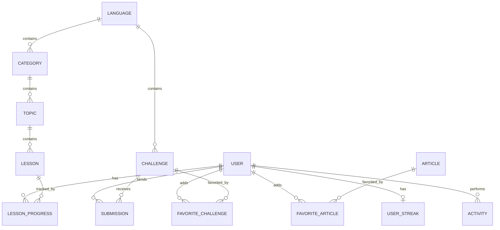

# Описание кода и реализации системы

## 1. Назначение системы

Разработанная система представляет собой приложение-справочник и учебник для программиста. Основная идея проекта заключается в объединении учебных материалов, справочной информации, практических задач, пользовательского прогресса и административного управления контентом в одном программном продукте.

Система состоит из нескольких частей:

- **Backend** — серверная часть на Node.js и Express.
- **Database** — база данных PostgreSQL, описанная через Prisma ORM.
- **Web frontend** — клиентское приложение на React, TypeScript и TailwindCSS.
- **iOS frontend** — мобильная часть на SwiftUI с архитектурой MVVM.
- **Admin panel** — административный интерфейс для управления учебным контентом.

Общая архитектура построена по клиент-серверному принципу. Клиентские приложения не работают с базой данных напрямую, а обращаются к Backend API. Backend проверяет права доступа, выполняет бизнес-логику, обращается к PostgreSQL через Prisma ORM и возвращает ответ клиенту.

```text
Пользователь
    |
    | Web / iOS
    v
Backend API Express
    |
    | Prisma ORM
    v
PostgreSQL
```

Администратор работает через отдельную административную панель, но она использует тот же Backend API.

```text
Администратор -> Admin Panel -> Backend API -> PostgreSQL
```

## 2. Структура проекта

Проект разделен на несколько основных каталогов.

```text
AppP/
├── backend/
│   ├── src/
│   │   ├── controllers/
│   │   ├── middleware/
│   │   ├── repositories/
│   │   ├── routes/
│   │   ├── services/
│   │   ├── utils/
│   │   ├── validators/
│   │   └── index.js
│   └── prisma/
│       └── schema.prisma
├── web/
│   └── src/
│       ├── api/
│       ├── auth/
│       ├── ui/
│       ├── views/
│       └── router.tsx
└── ios/
    └── AppP/Sources/
```

Такое разделение помогает отделить серверную логику от интерфейса и базы данных. Backend отвечает за API и бизнес-логику, frontend отвечает за отображение данных, а база данных хранит состояние системы.

## 3. Backend

Backend реализован на Node.js с использованием Express. Он выполняет следующие задачи:

- запуск HTTP-сервера;
- подключение middleware;
- регистрация API-маршрутов;
- обработка авторизации;
- валидация данных;
- обращение к базе данных через Prisma;
- возврат ответов клиенту в едином формате.

Главный файл серверной части — `backend/src/index.js`.

```js
require("dotenv").config();

const express = require("express");
const cors = require("cors");
const morgan = require("morgan");
const { ok } = require("./utils/response");
const { notFound, errorHandler } = require("./middleware/error");

const authRoutes = require("./routes/auth");
const languageRoutes = require("./routes/languages");
const guideRoutes = require("./routes/guides");
const articleRoutes = require("./routes/articles");
const categoryRoutes = require("./routes/categories");
const lessonRoutes = require("./routes/lessons");
const topicRoutes = require("./routes/topics");
const challengeRoutes = require("./routes/challenges");
const meRoutes = require("./routes/me");
const documentationRoutes = require("./routes/documentation");

const app = express();

app.use(cors());
app.use(express.json({ limit: "10mb" }));
app.use(morgan("dev"));

app.get("/health", (req, res) => ok(res, { status: "ok" }));

app.use("/auth", authRoutes);
app.use("/languages", languageRoutes);
app.use("/guides", guideRoutes);
app.use("/articles", articleRoutes);
app.use("/categories", categoryRoutes);
app.use("/topics", topicRoutes);
app.use("/lessons", lessonRoutes);
app.use("/challenges", challengeRoutes);
app.use("/me", meRoutes);
app.use("/documentation", documentationRoutes);

app.use(notFound);
app.use(errorHandler);
```

В этом файле видно, что все API-маршруты разделены по смысловым группам. Например, `/auth` отвечает за авторизацию, `/languages` — за языки программирования, `/lessons` — за уроки, `/challenges` — за задачи, а `/me` — за персональные данные пользователя.

Отдельно реализован технический маршрут `/health`, который используется для проверки работоспособности сервера.

```js
app.get("/health", (req, res) => ok(res, { status: "ok" }));
```

Если backend запущен, запрос:

```bash
curl -s http://localhost:3002/health
```

возвращает:

```json
{
  "data": {
    "status": "ok"
  },
  "error": null
}
```

## 4. Единый формат API-ответов

Во всем backend используется единый формат ответа:

```json
{
  "data": "...",
  "error": null
}
```

или:

```json
{
  "data": null,
  "error": "описание ошибки"
}
```

Это реализовано в файле `backend/src/utils/response.js`.

```js
function ok(res, data, status = 200) {
  return res.status(status).json({ data, error: null });
}

function fail(res, error, status = 400) {
  const message = typeof error === "string" ? error : "Unknown error";
  return res.status(status).json({ data: null, error: message });
}

module.exports = { ok, fail };
```

Такой подход упрощает frontend. Клиент всегда знает, что в ответе есть два поля: `data` и `error`. Если `error` равен `null`, значит запрос выполнен успешно. Если `data` равен `null`, значит произошла ошибка.

## 5. Авторизация и роли пользователей

В системе есть две роли:

- `user` — обычный пользователь;
- `admin` — администратор.

Авторизация построена на JWT. После регистрации или входа backend выдает токен, который frontend сохраняет и затем отправляет в заголовке `Authorization`.

Фрагмент создания JWT находится в `backend/src/routes/auth.js`.

```js
function signToken(user) {
  const secret = process.env.JWT_SECRET;
  if (!secret) {
    const err = new Error("Server misconfigured: JWT_SECRET missing");
    err.status = 500;
    throw err;
  }
  return jwt.sign(
    { userId: user.id, role: user.role, email: user.email },
    secret,
    { expiresIn: "7d" }
  );
}
```

При регистрации пароль пользователя не сохраняется в открытом виде. Он хешируется через `bcryptjs`.

```js
const hashed = await bcrypt.hash(password, 10);
const user = await prisma.user.create({
  data: { email, password: hashed, role: "user" },
  select: { id: true, email: true, role: true },
});

const token = signToken(user);
return ok(res, { token, user }, 201);
```

При входе backend ищет пользователя по email и сравнивает пароль с сохраненным хешем.

```js
const user = await prisma.user.findUnique({ where: { email } });
if (!user) return fail(res, "Invalid credentials", 401);

const valid = await bcrypt.compare(password, user.password);
if (!valid) return fail(res, "Invalid credentials", 401);

const token = signToken(user);
return ok(res, {
  token,
  user: { id: user.id, email: user.email, role: user.role }
});
```

Защита маршрутов реализована в `backend/src/middleware/auth.js`.

```js
function requireAuth(req, res, next) {
  const header = req.headers.authorization || "";
  const [type, token] = header.split(" ");
  if (type !== "Bearer" || !token) {
    return fail(res, "Unauthorized", 401);
  }

  try {
    const secret = process.env.JWT_SECRET;
    if (!secret) return fail(res, "Server misconfigured: JWT_SECRET missing", 500);

    const payload = jwt.verify(token, secret);
    req.user = payload;
    return next();
  } catch {
    return fail(res, "Unauthorized", 401);
  }
}
```

Для проверки роли администратора используется middleware `requireRole`.

```js
function requireRole(role) {
  return (req, res, next) => {
    if (!req.user) return fail(res, "Unauthorized", 401);
    if (req.user.role !== role) return fail(res, "Forbidden", 403);
    return next();
  };
}
```

Таким образом, сначала проверяется сам факт авторизации, а затем роль пользователя.

## 6. API маршруты

API разделено на логические группы.

| Группа API | Назначение |
|---|---|
| `/auth` | регистрация и вход |
| `/languages` | языки программирования |
| `/guides` | справочные материалы и библиотеки |
| `/articles` | статьи |
| `/documentation` | документация |
| `/categories` | главы учебного контента |
| `/topics` | темы внутри глав |
| `/lessons` | уроки |
| `/challenges` | практические задачи |
| `/me` | профиль, статистика, активность, избранное |

Пример маршрутов уроков:

```js
const express = require("express");
const { requireAuth, requireRole } = require("../middleware/auth");
const controller = require("../controllers/lessonsController");

const router = express.Router();

// Public
router.get("/:id", controller.getLesson);

// Auth
router.post("/:id/complete", requireAuth, controller.completeLesson);

// Admin
router.post("/", requireAuth, requireRole("admin"), controller.createLesson);
router.put("/:id", requireAuth, requireRole("admin"), controller.updateLesson);
router.delete("/:id", requireAuth, requireRole("admin"), controller.deleteLesson);

module.exports = router;
```

Здесь видно разделение доступа:

- `GET /lessons/:id` доступен публично;
- `POST /lessons/:id/complete` доступен только авторизованному пользователю;
- `POST`, `PUT`, `DELETE` доступны только администратору.

Пример маршрутов задач:

```js
// Public
router.get("/", controller.listChallenges);
router.get("/:id", controller.getChallenge);

// Auth
router.post("/:id/submit", requireAuth, controller.submitToChallenge);
router.get("/:id/submissions", requireAuth, controller.listMySubmissions);

// Admin
router.post("/", requireAuth, requireRole("admin"), controller.createChallenge);
router.put("/:id", requireAuth, requireRole("admin"), controller.updateChallenge);
router.delete("/:id", requireAuth, requireRole("admin"), controller.deleteChallenge);
```

## 7. Реализация прогресса уроков

Когда пользователь завершает урок, frontend отправляет запрос:

```http
POST /lessons/:id/complete
```

Этот маршрут требует авторизации. В контроллере проверяется id урока, наличие пользователя и существование урока.

```js
async function completeLesson(req, res) {
  const id = Number(req.params.id);
  if (!Number.isInteger(id)) return fail(res, "Invalid id", 400);
  if (!req.user?.userId) return fail(res, "Unauthorized", 401);

  const lesson = await lessonRepo.getLessonById(id);
  if (!lesson) return fail(res, "Lesson not found", 404);

  const progress = await progressRepo.upsertProgress({
    userId: req.user.userId,
    lessonId: id,
    status: "completed",
    completedAt: new Date(),
  });

  await recordActivity({
    userId: req.user.userId,
    type: "lesson_completed",
    meta: { lessonId: id, topicId: lesson.topicId },
  });

  return ok(res, progress);
}
```

В этом фрагменте реализованы сразу несколько действий:

1. Проверяется корректность id.
2. Проверяется авторизация пользователя.
3. Проверяется существование урока.
4. Создается или обновляется прогресс.
5. Записывается активность пользователя.
6. Клиенту возвращается обновленный прогресс.

## 8. Реализация задач и отправки решений

Практические задачи хранятся в таблице `Challenge`. Пользователь может открыть список задач, выбрать задачу и отправить решение.

Фрагмент контроллера отправки решения:

```js
async function submitToChallenge(req, res) {
  const id = Number(req.params.id);
  if (!Number.isInteger(id)) return fail(res, "Invalid id", 400);
  if (!req.user?.userId) return fail(res, "Unauthorized", 401);

  const parsed = submissionCreateSchema.safeParse(req.body);
  if (!parsed.success) return fail(res, parsed.error.issues[0]?.message || "Invalid payload", 400);

  const challenge = await challengeRepo.getChallengeById(id);
  if (!challenge) return fail(res, "Challenge not found", 404);

  const verdict = evaluateSubmission({
    code: parsed.data.code,
    expectedOutput: challenge.expectedOutput
  });

  const created = await submissionRepo.createSubmission({
    userId: req.user.userId,
    challengeId: id,
    code: parsed.data.code,
    status: verdict.status,
    output: verdict.output,
    error: verdict.error,
  });

  await recordActivity({
    userId: req.user.userId,
    type: verdict.status === "accepted" ? "challenge_accepted" : "challenge_attempted",
    meta: { challengeId: id, status: verdict.status },
  });

  return ok(res, created, 201);
}
```

Здесь решение пользователя сохраняется в базе данных как `Submission`. Также записывается активность пользователя. Если решение принято, тип активности будет `challenge_accepted`, иначе — `challenge_attempted`.

## 9. База данных

База данных реализована в PostgreSQL. Схема описана через Prisma в файле `backend/prisma/schema.prisma`.

Основные сущности:

- `User` — пользователь системы;
- `Language` — язык программирования;
- `Guide` — справочный материал или библиотека;
- `Article` — статья;
- `DocumentationPage` — страница документации;
- `Category` — учебная глава;
- `Topic` — тема внутри главы;
- `Lesson` — урок;
- `LessonProgress` — прогресс пользователя по уроку;
- `Challenge` — практическая задача;
- `Submission` — отправленное решение задачи;
- `FavoriteArticle` — избранная статья;
- `FavoriteChallenge` — избранная задача;
- `UserStreak` — серия активности пользователя;
- `Activity` — история действий пользователя.

### Пользователь

```prisma
model User {
  id        Int      @id @default(autoincrement())
  email     String   @unique
  password  String
  role      Role     @default(user)
  createdAt DateTime @default(now())
  updatedAt DateTime @updatedAt

  lessonProgresses LessonProgress[]
  submissions      Submission[]
  streak           UserStreak?
  activities       Activity[]

  favoriteArticles   FavoriteArticle[]
  favoriteChallenges FavoriteChallenge[]
}
```

Пользователь связан с прогрессом, решениями задач, избранным, серией активности и историей действий.

### Учебный контент

Учебная структура построена как иерархия:

```text
Language -> Category -> Topic -> Lesson
```

Фрагменты моделей:

```prisma
model Language {
  id          Int         @id @default(autoincrement())
  name        String
  description String
  icon        String
  guides      Guide[]
  categories  Category[]
  challenges  Challenge[]
  createdAt   DateTime    @default(now())
  updatedAt   DateTime    @updatedAt
}
```

```prisma
model Category {
  id        Int      @id @default(autoincrement())
  title     String   @map("name")
  languageId Int?
  language   Language? @relation(fields: [languageId], references: [id], onDelete: Cascade)
  topics    Topic[]
  createdAt DateTime @default(now())
  updatedAt DateTime @updatedAt
}
```

```prisma
model Topic {
  id          Int      @id @default(autoincrement())
  title       String
  categoryId  Int
  category    Category @relation(fields: [categoryId], references: [id], onDelete: Cascade)
  order       Int
  lessons     Lesson[]
  createdAt   DateTime @default(now())
  updatedAt   DateTime @updatedAt

  @@unique([categoryId, order])
}
```

```prisma
model Lesson {
  id        Int      @id @default(autoincrement())
  title     String
  content   String
  topicId   Int
  order     Int
  topic     Topic    @relation(fields: [topicId], references: [id], onDelete: Cascade)
  createdAt DateTime @default(now())
  updatedAt DateTime @updatedAt

  progresses LessonProgress[]

  @@unique([topicId, order])
}
```

Такая модель позволяет добавлять новые языки, главы, темы и уроки без изменения кода приложения.

### Прогресс пользователя

```prisma
model LessonProgress {
  id          Int          @id @default(autoincrement())
  userId      Int
  lessonId    Int
  status      LessonStatus @default(in_progress)
  startedAt   DateTime     @default(now())
  completedAt DateTime?
  createdAt   DateTime     @default(now())
  updatedAt   DateTime     @updatedAt

  user   User   @relation(fields: [userId], references: [id], onDelete: Cascade)
  lesson Lesson @relation(fields: [lessonId], references: [id], onDelete: Cascade)

  @@unique([userId, lessonId])
}
```

Уникальное ограничение `@@unique([userId, lessonId])` не позволяет создать несколько одинаковых записей прогресса для одного пользователя и одного урока.

### Практические задачи

```prisma
model Challenge {
  id             Int                 @id @default(autoincrement())
  title          String
  description    String
  difficulty     ChallengeDifficulty
  starterCode    String
  expectedOutput String
  languageId     Int
  language       Language            @relation(fields: [languageId], references: [id], onDelete: Cascade)
  createdAt      DateTime            @default(now())
  updatedAt      DateTime            @updatedAt

  submissions Submission[]
  favoritedBy FavoriteChallenge[]
}
```

```prisma
model Submission {
  id          Int              @id @default(autoincrement())
  userId      Int
  challengeId Int
  code        String
  status      SubmissionStatus @default(pending)
  output      String?
  error       String?
  createdAt   DateTime         @default(now())
  updatedAt   DateTime         @updatedAt

  user      User      @relation(fields: [userId], references: [id], onDelete: Cascade)
  challenge Challenge @relation(fields: [challengeId], references: [id], onDelete: Cascade)
}
```

Модель `Challenge` хранит само задание, а `Submission` хранит решение конкретного пользователя.

## 10. ER-связи базы данных

Основные связи базы данных:

```text
Language 1 -> N Guide
Language 1 -> N Category
Language 1 -> N Challenge

Category 1 -> N Topic
Topic 1 -> N Lesson

User 1 -> N LessonProgress
Lesson 1 -> N LessonProgress

User 1 -> N Submission
Challenge 1 -> N Submission

User 1 -> N FavoriteArticle
Article 1 -> N FavoriteArticle

User 1 -> N FavoriteChallenge
Challenge 1 -> N FavoriteChallenge

User 1 -> 0..1 UserStreak
User 1 -> N Activity
```

В виде Mermaid:



## 11. Frontend

Frontend реализован на React и TypeScript. Он отвечает за отображение интерфейса, навигацию, вызов API и хранение токена пользователя.

Основные страницы:

- `/` — главная;
- `/dashboard` — сводка активности;
- `/languages` — список языков;
- `/languages/:id` — страница выбранного языка;
- `/guides` — справочные материалы;
- `/challenges` — задачи;
- `/articles` — статьи;
- `/articles/:id` — отдельная статья;
- `/documentation` — документация;
- `/profile` — профиль;
- `/login` — вход;
- `/register` — регистрация;
- `/admin/login` — вход администратора;
- `/admin` — административная панель.

Роутинг описан в `web/src/router.tsx`.

```tsx
export const router = createBrowserRouter([
  {
    element: <AppLayout />,
    children: [
      { path: "/", element: <HomePage /> },
      { path: "/dashboard", element: <DashboardPage /> },
      { path: "/languages", element: <LanguagesPage /> },
      { path: "/languages/:id", element: <LanguageDetailPage /> },
      { path: "/guides", element: <GuidesPage /> },
      { path: "/challenges", element: <ChallengesPage /> },
      { path: "/profile", element: <ProfilePage /> },
      { path: "/login", element: <LoginPage /> },
      { path: "/register", element: <RegisterPage /> },
      { path: "/articles", element: <ArticlesPage /> },
      { path: "/articles/:id", element: <ArticleDetailPage /> },
      { path: "/documentation", element: <DocumentationPage /> },
      { path: "/admin/login", element: <AdminLoginPage /> },
      { path: "/admin", element: <AdminGatePage children={<AdminPanelPage />} /> },
    ],
  },
]);
```

Все страницы находятся внутри общего layout, поэтому приложение имеет единую структуру навигации.

## 12. Frontend API client

Для работы с backend во frontend используется отдельный API-клиент. Он находится в `web/src/api/client.ts`.

```ts
const BASE_URL = (import.meta.env.VITE_API_BASE_URL as string | undefined) ?? "http://localhost:3002";

export async function apiGet<T>(path: string): Promise<ApiResponse<T>> {
  const token = getToken();
  const res = await fetch(`${BASE_URL}${path}`, {
    headers: {
      Accept: "application/json",
      ...(token ? { Authorization: `Bearer ${token}` } : {}),
    },
  });

  if (!res.ok) {
    try {
      return (await res.json()) as ApiResponse<T>;
    } catch {
      return { data: null, error: `HTTP ${res.status}` };
    }
  }

  return (await res.json()) as ApiResponse<T>;
}
```

Клиент автоматически добавляет JWT-токен в запрос, если пользователь авторизован.

```ts
...(token ? { Authorization: `Bearer ${token}` } : {})
```

Это позволяет использовать один и тот же API-клиент для публичных и защищенных запросов.

Для `POST`, `PUT` и `DELETE` реализованы отдельные функции:

```ts
export async function apiPost<T>(path: string, body: unknown): Promise<ApiResponse<T>> {
  const token = getToken();
  const res = await fetch(`${BASE_URL}${path}`, {
    method: "POST",
    headers: {
      Accept: "application/json",
      "Content-Type": "application/json",
      ...(token ? { Authorization: `Bearer ${token}` } : {}),
    },
    body: JSON.stringify(body),
  });

  return (await res.json()) as ApiResponse<T>;
}
```

## 13. Frontend endpoints

Поверх низкоуровневого API-клиента создан файл `web/src/api/endpoints.ts`. Он содержит методы, которые соответствуют backend-маршрутам.

Примеры:

```ts
export const api = {
  login(payload: { email: string; password: string }): Promise<ApiResponse<AuthSuccess>> {
    return apiPost<AuthSuccess>("/auth/login", payload);
  },
  register(payload: { email: string; password: string }): Promise<ApiResponse<AuthSuccess>> {
    return apiPost<AuthSuccess>("/auth/register", payload);
  },
  languages(): Promise<ApiResponse<Language[]>> {
    return apiGet<Language[]>("/languages");
  },
  lesson(id: number): Promise<ApiResponse<Lesson>> {
    return apiGet<Lesson>(`/lessons/${id}`);
  },
  completeLesson(id: number): Promise<ApiResponse<unknown>> {
    return apiPost(`/lessons/${id}/complete`, {});
  },
};
```

Отдельно описана работа с задачами:

```ts
challenges(params?: { languageId?: number; difficulty?: ChallengeDifficulty }): Promise<ApiResponse<Challenge[]>> {
  const q = new URLSearchParams();
  if (params?.languageId != null) q.set("languageId", String(params.languageId));
  if (params?.difficulty) q.set("difficulty", params.difficulty);
  const qs = q.toString();
  return apiGet<Challenge[]>(`/challenges${qs ? `?${qs}` : ""}`);
},

submitChallenge(id: number, payload: { code: string }): Promise<ApiResponse<Submission>> {
  return apiPost<Submission>(`/challenges/${id}/submit`, payload);
},
```

Такой слой делает код страниц проще: компонент вызывает `api.languages()` или `api.submitChallenge()`, не зная деталей HTTP-запроса.

## 14. Персональные данные пользователя

Для профиля, статистики, активности и избранного используется файл `web/src/api/me.ts`.

```ts
export const meApi = {
  profile(): Promise<ApiResponse<{ id: number; email: string; role: string; createdAt: string; updatedAt: string }>> {
    return apiGet("/me/profile");
  },
  stats(): Promise<ApiResponse<MeStats>> {
    return apiGet("/me/stats");
  },
  activity(take = 30): Promise<ApiResponse<Activity[]>> {
    return apiGet(`/me/activity?take=${take}`);
  },
  favorites(): Promise<ApiResponse<Favorites>> {
    return apiGet("/me/favorites");
  },
  progress(topicId?: number): Promise<ApiResponse<LessonProgress[]>> {
    const q = typeof topicId === "number" ? `?topicId=${topicId}` : "";
    return apiGet(`/me/progress${q}`);
  },
};
```

Эти запросы требуют авторизации, потому что относятся к конкретному пользователю.

## 15. Административная панель

Административная панель нужна для управления учебным контентом. Она позволяет:

- создавать языки программирования;
- редактировать языки;
- создавать гайды;
- создавать статьи;
- создавать главы;
- создавать темы;
- создавать и редактировать уроки;
- создавать задачи;
- управлять документацией.

Доступ к админке защищен ролью `admin`. На backend это реализуется через:

```js
requireAuth
requireRole("admin")
```

Пример:

```js
router.post("/", requireAuth, requireRole("admin"), controller.createLesson);
router.put("/:id", requireAuth, requireRole("admin"), controller.updateLesson);
router.delete("/:id", requireAuth, requireRole("admin"), controller.deleteLesson);
```

Это означает, что обычный пользователь может читать уроки, но не может создавать, изменять или удалять их.

## 16. Проектирование системы

При проектировании системы были выделены следующие уровни:

1. **Уровень представления** — React web-интерфейс и SwiftUI iOS-интерфейс.
2. **Уровень API** — Express-маршруты.
3. **Уровень бизнес-логики** — controllers и services.
4. **Уровень доступа к данным** — repositories и Prisma Client.
5. **Уровень хранения** — PostgreSQL.

Логика обработки запроса выглядит так:

```text
Frontend
  -> API client
  -> Express route
  -> middleware авторизации
  -> controller
  -> repository/service
  -> Prisma
  -> PostgreSQL
  -> ответ { data, error }
```

Пример сценария завершения урока:

```text
1. Пользователь нажимает кнопку завершения урока.
2. Frontend вызывает POST /lessons/:id/complete.
3. API client добавляет JWT в Authorization.
4. Backend проверяет токен через requireAuth.
5. Controller проверяет существование урока.
6. Repository создает или обновляет LessonProgress.
7. Service записывает Activity.
8. Backend возвращает обновленный прогресс.
```

Пример сценария решения задачи:

```text
1. Пользователь открывает задачу.
2. Frontend отправляет код на POST /challenges/:id/submit.
3. Backend проверяет авторизацию.
4. Controller валидирует тело запроса.
5. Backend получает Challenge из базы.
6. Service evaluateSubmission сравнивает решение с expectedOutput.
7. Submission сохраняется в базе.
8. Activity записывает попытку или успешное решение.
9. Frontend показывает результат пользователю.
```

## 17. Почему выбрана такая архитектура

Клиент-серверная архитектура выбрана потому, что она позволяет использовать один backend для разных клиентов. Web-приложение и iOS-приложение могут работать с одним и тем же REST API.

Преимущества такого подхода:

- единая бизнес-логика на backend;
- единая база данных;
- возможность подключить новые клиенты;
- проще тестировать API отдельно от интерфейса;
- проще защищать закрытые маршруты;
- удобнее расширять систему.

Backend не зависит от конкретного frontend. Frontend не знает, как именно устроена база данных. Он работает только с API.

## 18. Технологический стек

| Компонент | Технологии |
|---|---|
| Backend | Node.js, Express |
| ORM | Prisma |
| Database | PostgreSQL |
| Auth | JWT, bcryptjs |
| Validation | Zod |
| Web frontend | React, TypeScript |
| Build tool | Vite |
| Styling | TailwindCSS |
| Rich text editor | TipTap |
| iOS | SwiftUI, MVVM |

## 19. Локальный запуск

Для запуска backend:

```bash
cd backend
npm i
npm run prisma:migrate
npm run dev
```

Backend запускается на порту `3002`.

Для запуска frontend:

```bash
cd web
npm i
cp .env.example .env
npm run dev
```

В `web/.env` должен быть указан адрес backend:

```env
VITE_API_BASE_URL="http://localhost:3002"
```

Проверка backend:

```bash
curl -s http://localhost:3002/health
```

Проверка списка языков:

```bash
curl -s http://localhost:3002/languages
```

## 20. Итог

В результате реализована система, которая включает backend, web frontend, базу данных и основу iOS-клиента. Backend предоставляет REST API, frontend отображает данные и отправляет запросы, PostgreSQL хранит контент и пользовательские данные, а Prisma связывает серверную часть с базой данных.

Система спроектирована так, чтобы ее можно было расширять:

- добавлять новые языки программирования;
- добавлять новые главы, темы и уроки;
- расширять список задач;
- улучшать проверку решений;
- развивать мобильное приложение;
- добавлять аналитику прогресса;
- расширять административную панель.

Основной принцип реализации — разделение ответственности между слоями. Frontend отвечает за интерфейс, backend отвечает за логику и безопасность, база данных отвечает за хранение, а API связывает все части системы.
