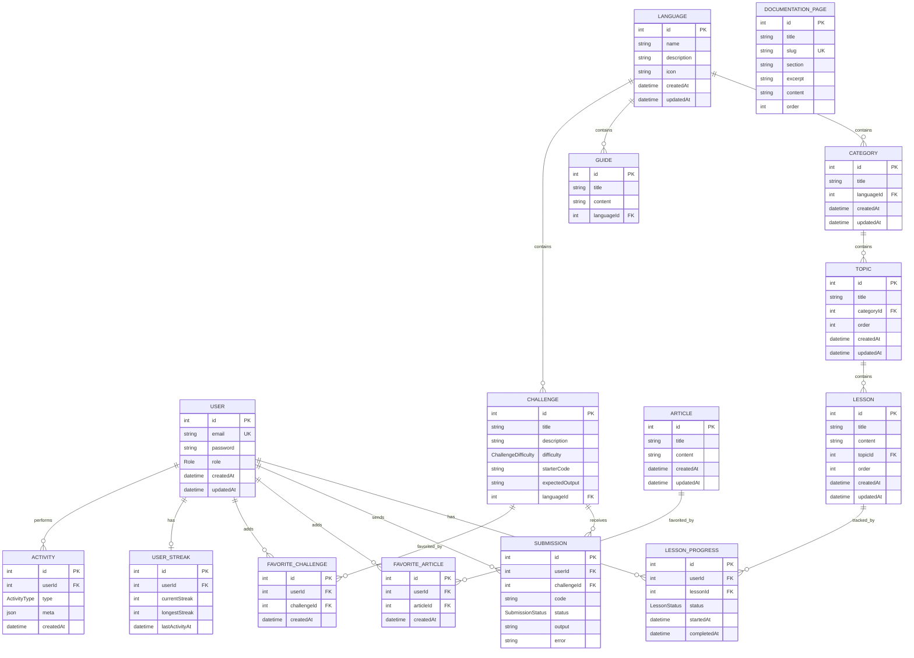

# Описание схемы базы данных

## 1. Общая характеристика базы данных

В проекте используется реляционная база данных **PostgreSQL**. Работа с базой данных выполняется через **Prisma ORM**, а структура таблиц описана в файле `backend/prisma/schema.prisma`.

База данных предназначена для хранения:

- пользователей системы;
- ролей пользователей;
- языков программирования;
- учебных глав, тем и уроков;
- справочных материалов;
- статей;
- документации;
- практических задач;
- решений пользователей;
- прогресса прохождения уроков;
- избранных материалов;
- активности пользователя.

Схема базы данных построена вокруг двух основных направлений:

1. **Учебный контент** — языки, главы, темы, уроки, статьи, документация и задачи.
2. **Пользовательские данные** — профиль, прогресс, решения задач, избранное и активность.

## 2. Основные сущности базы данных

### 2.1. User

Таблица `User` хранит учетные записи пользователей.

```prisma
model User {
  id        Int      @id @default(autoincrement())
  email     String   @unique
  password  String
  role      Role     @default(user)
  createdAt DateTime @default(now())
  updatedAt DateTime @updatedAt

  lessonProgresses LessonProgress[]
  submissions      Submission[]
  streak           UserStreak?
  activities       Activity[]

  favoriteArticles   FavoriteArticle[]
  favoriteChallenges FavoriteChallenge[]
}
```

Назначение полей:

| Поле | Назначение |
|---|---|
| `id` | уникальный идентификатор пользователя |
| `email` | email пользователя, используется для входа |
| `password` | хеш пароля |
| `role` | роль пользователя: `user` или `admin` |
| `createdAt` | дата создания пользователя |
| `updatedAt` | дата последнего обновления |

Поле `email` имеет ограничение `@unique`, поэтому в системе не может быть двух пользователей с одинаковым email.

## 3. Роли пользователей

Роли описаны через enum `Role`.

```prisma
enum Role {
  user
  admin
}
```

Роль `user` используется для обычных пользователей. Роль `admin` дает доступ к административной панели и операциям создания, редактирования и удаления учебного контента.

## 4. Учебный контент

Учебный контент имеет иерархическую структуру:

```text
Language -> Category -> Topic -> Lesson
```

То есть язык программирования содержит главы, глава содержит темы, а тема содержит уроки.

## 5. Language

Таблица `Language` хранит языки программирования.

```prisma
model Language {
  id          Int         @id @default(autoincrement())
  name        String
  description String
  icon        String
  guides      Guide[]
  categories  Category[]
  challenges  Challenge[]
  createdAt   DateTime    @default(now())
  updatedAt   DateTime    @updatedAt
}
```

Назначение:

- хранит название языка программирования;
- содержит описание языка;
- хранит иконку;
- связывается со справочными материалами;
- связывается с учебными главами;
- связывается с практическими задачами.

Один язык может иметь много глав, гайдов и задач.

## 6. Category

Таблица `Category` хранит учебные главы.

```prisma
model Category {
  id        Int      @id @default(autoincrement())
  title     String   @map("name")
  languageId Int?
  language   Language? @relation(fields: [languageId], references: [id], onDelete: Cascade)
  topics    Topic[]
  createdAt DateTime @default(now())
  updatedAt DateTime @updatedAt

  @@index([languageId])
}
```

Глава может быть связана с конкретным языком программирования через поле `languageId`.

Связь:

```text
Language 1 -> N Category
```

Если язык удаляется, связанные с ним главы удаляются каскадно благодаря `onDelete: Cascade`.

## 7. Topic

Таблица `Topic` хранит темы внутри главы.

```prisma
model Topic {
  id          Int      @id @default(autoincrement())
  title       String
  categoryId  Int
  category    Category @relation(fields: [categoryId], references: [id], onDelete: Cascade)
  order       Int
  lessons     Lesson[]
  createdAt   DateTime @default(now())
  updatedAt   DateTime @updatedAt

  @@unique([categoryId, order])
  @@index([categoryId])
}
```

Назначение полей:

| Поле | Назначение |
|---|---|
| `title` | название темы |
| `categoryId` | ссылка на главу |
| `order` | порядок темы внутри главы |

Ограничение:

```prisma
@@unique([categoryId, order])
```

Оно означает, что внутри одной главы не может быть двух тем с одинаковым порядковым номером.

Связь:

```text
Category 1 -> N Topic
```

## 8. Lesson

Таблица `Lesson` хранит уроки.

```prisma
model Lesson {
  id        Int      @id @default(autoincrement())
  title     String
  content   String
  topicId   Int
  order     Int
  topic     Topic    @relation(fields: [topicId], references: [id], onDelete: Cascade)
  createdAt DateTime @default(now())
  updatedAt DateTime @updatedAt

  progresses LessonProgress[]

  @@unique([topicId, order])
  @@index([topicId])
}
```

Назначение:

- хранит название урока;
- хранит текстовое содержимое урока;
- связывается с темой;
- имеет порядок отображения внутри темы;
- связывается с прогрессом пользователей.

Связь:

```text
Topic 1 -> N Lesson
```

Ограничение `@@unique([topicId, order])` запрещает двум урокам внутри одной темы иметь одинаковый порядок.

## 9. LessonProgress

Таблица `LessonProgress` хранит прогресс пользователя по урокам.

```prisma
model LessonProgress {
  id          Int          @id @default(autoincrement())
  userId      Int
  lessonId    Int
  status      LessonStatus @default(in_progress)
  startedAt   DateTime     @default(now())
  completedAt DateTime?
  createdAt   DateTime     @default(now())
  updatedAt   DateTime     @updatedAt

  user   User   @relation(fields: [userId], references: [id], onDelete: Cascade)
  lesson Lesson @relation(fields: [lessonId], references: [id], onDelete: Cascade)

  @@unique([userId, lessonId])
  @@index([lessonId])
}
```

Статусы прогресса описаны через enum:

```prisma
enum LessonStatus {
  in_progress
  completed
}
```

Таблица связывает пользователя и урок:

```text
User 1 -> N LessonProgress
Lesson 1 -> N LessonProgress
```

Ограничение:

```prisma
@@unique([userId, lessonId])
```

Оно нужно, чтобы у одного пользователя была только одна запись прогресса для одного урока.

## 10. Guide

Таблица `Guide` хранит справочные материалы, связанные с языком программирования.

```prisma
model Guide {
  id         Int      @id @default(autoincrement())
  title      String
  content    String
  languageId Int
  language   Language @relation(fields: [languageId], references: [id], onDelete: Cascade)
  createdAt  DateTime @default(now())
  updatedAt  DateTime @updatedAt

  @@index([languageId])
}
```

Связь:

```text
Language 1 -> N Guide
```

Например, для языка Python могут быть созданы справочные материалы по стандартной библиотеке, backend-разработке, Data Science или автоматизации.

## 11. Article

Таблица `Article` хранит статьи.

```prisma
model Article {
  id        Int      @id @default(autoincrement())
  title     String
  content   String
  createdAt DateTime @default(now())
  updatedAt DateTime @updatedAt

  favoritedBy FavoriteArticle[]
}
```

Статьи не привязаны напрямую к языкам программирования. Они могут использоваться как дополнительные материалы.

Пользователь может добавить статью в избранное через таблицу `FavoriteArticle`.

## 12. DocumentationPage

Таблица `DocumentationPage` хранит страницы документации.

```prisma
model DocumentationPage {
  id        Int      @id @default(autoincrement())
  title     String
  slug      String   @unique
  section   String
  excerpt   String
  content   String
  order     Int      @default(1)
  createdAt DateTime @default(now())
  updatedAt DateTime @updatedAt

  @@index([section])
  @@index([order])
}
```

Назначение полей:

| Поле | Назначение |
|---|---|
| `title` | название страницы |
| `slug` | уникальный человекочитаемый идентификатор |
| `section` | раздел документации |
| `excerpt` | краткое описание |
| `content` | основной текст |
| `order` | порядок отображения |

Поле `slug` уникально, поэтому две страницы документации не могут иметь одинаковый адрес.

## 13. Challenge

Таблица `Challenge` хранит практические задачи.

```prisma
model Challenge {
  id             Int                 @id @default(autoincrement())
  title          String
  description    String
  difficulty     ChallengeDifficulty
  starterCode    String
  expectedOutput String
  languageId     Int
  language       Language            @relation(fields: [languageId], references: [id], onDelete: Cascade)
  createdAt      DateTime            @default(now())
  updatedAt      DateTime            @updatedAt

  submissions Submission[]
  favoritedBy FavoriteChallenge[]

  @@index([languageId])
  @@index([difficulty])
}
```

Сложность задачи описана через enum:

```prisma
enum ChallengeDifficulty {
  easy
  medium
  hard
}
```

Задача связана с языком программирования:

```text
Language 1 -> N Challenge
```

Поля `starterCode` и `expectedOutput` используются для практической части: пользователь видит стартовый код и отправляет решение, которое сравнивается с ожидаемым результатом.

## 14. Submission

Таблица `Submission` хранит решения задач, отправленные пользователями.

```prisma
model Submission {
  id          Int              @id @default(autoincrement())
  userId      Int
  challengeId Int
  code        String
  status      SubmissionStatus @default(pending)
  output      String?
  error       String?
  createdAt   DateTime         @default(now())
  updatedAt   DateTime         @updatedAt

  user      User      @relation(fields: [userId], references: [id], onDelete: Cascade)
  challenge Challenge @relation(fields: [challengeId], references: [id], onDelete: Cascade)

  @@index([userId])
  @@index([challengeId])
}
```

Статус решения описан через enum:

```prisma
enum SubmissionStatus {
  pending
  accepted
  wrong_answer
  runtime_error
}
```

Связи:

```text
User 1 -> N Submission
Challenge 1 -> N Submission
```

Один пользователь может отправить много решений. Одна задача также может иметь много отправленных решений от разных пользователей.

## 15. Избранное

В системе есть два типа избранного:

- избранные статьи;
- избранные задачи.

### FavoriteArticle

```prisma
model FavoriteArticle {
  id        Int      @id @default(autoincrement())
  userId    Int
  articleId Int
  createdAt DateTime @default(now())

  user    User    @relation(fields: [userId], references: [id], onDelete: Cascade)
  article Article @relation(fields: [articleId], references: [id], onDelete: Cascade)

  @@unique([userId, articleId])
  @@index([articleId])
}
```

Связи:

```text
User 1 -> N FavoriteArticle
Article 1 -> N FavoriteArticle
```

Ограничение `@@unique([userId, articleId])` не позволяет пользователю добавить одну и ту же статью в избранное несколько раз.

### FavoriteChallenge

```prisma
model FavoriteChallenge {
  id          Int      @id @default(autoincrement())
  userId      Int
  challengeId Int
  createdAt   DateTime @default(now())

  user      User      @relation(fields: [userId], references: [id], onDelete: Cascade)
  challenge Challenge @relation(fields: [challengeId], references: [id], onDelete: Cascade)

  @@unique([userId, challengeId])
  @@index([challengeId])
}
```

Связи:

```text
User 1 -> N FavoriteChallenge
Challenge 1 -> N FavoriteChallenge
```

## 16. UserStreak

Таблица `UserStreak` хранит серию активности пользователя.

```prisma
model UserStreak {
  id             Int       @id @default(autoincrement())
  userId         Int       @unique
  currentStreak  Int       @default(0)
  longestStreak  Int       @default(0)
  lastActivityAt DateTime?
  updatedAt      DateTime  @updatedAt
  createdAt      DateTime  @default(now())

  user User @relation(fields: [userId], references: [id], onDelete: Cascade)
}
```

Назначение:

- `currentStreak` — текущая серия активности;
- `longestStreak` — максимальная серия активности;
- `lastActivityAt` — дата последней активности.

Связь:

```text
User 1 -> 0..1 UserStreak
```

Поле `userId` имеет ограничение `@unique`, поэтому у пользователя может быть только одна запись серии активности.

## 17. Activity

Таблица `Activity` хранит историю действий пользователя.

```prisma
model Activity {
  id        Int          @id @default(autoincrement())
  userId    Int
  type      ActivityType
  meta      Json?
  createdAt DateTime     @default(now())

  user User @relation(fields: [userId], references: [id], onDelete: Cascade)

  @@index([userId, createdAt])
  @@index([type])
}
```

Типы активности:

```prisma
enum ActivityType {
  lesson_completed
  challenge_attempted
  challenge_accepted
  streak_updated
  favorite_added
}
```

Таблица используется для отображения недавних действий пользователя, например:

- завершение урока;
- попытка решения задачи;
- успешное решение задачи;
- добавление материала в избранное.

Поле `meta` имеет тип `Json?`, поэтому в него можно сохранять дополнительные данные о действии, например `lessonId`, `topicId` или `challengeId`.

## 18. Полная схема связей



## 19. Индексы и ограничения

В схеме используются индексы и уникальные ограничения.

### Уникальные ограничения

| Ограничение | Назначение |
|---|---|
| `User.email @unique` | запрещает одинаковые email |
| `DocumentationPage.slug @unique` | запрещает одинаковые slug страниц |
| `Topic @@unique([categoryId, order])` | запрещает одинаковый порядок тем внутри главы |
| `Lesson @@unique([topicId, order])` | запрещает одинаковый порядок уроков внутри темы |
| `LessonProgress @@unique([userId, lessonId])` | одна запись прогресса на пользователя и урок |
| `FavoriteArticle @@unique([userId, articleId])` | статья не может быть добавлена в избранное дважды |
| `FavoriteChallenge @@unique([userId, challengeId])` | задача не может быть добавлена в избранное дважды |
| `UserStreak.userId @unique` | одна запись streak на пользователя |

### Индексы

Индексы используются для ускорения поиска и фильтрации:

- `Guide.languageId`;
- `Category.languageId`;
- `Topic.categoryId`;
- `Lesson.topicId`;
- `Challenge.languageId`;
- `Challenge.difficulty`;
- `Submission.userId`;
- `Submission.challengeId`;
- `Activity.userId + createdAt`;
- `Activity.type`.

## 20. Логика удаления данных

Во многих связях используется:

```prisma
onDelete: Cascade
```

Это означает каскадное удаление связанных записей.

Например:

- если удалить язык программирования, удалятся связанные главы, гайды и задачи;
- если удалить тему, удалятся связанные уроки;
- если удалить пользователя, удалятся его прогресс, решения, активность и избранное;
- если удалить задачу, удалятся связанные решения и записи избранного.

Такой подход помогает не оставлять в базе данных «осиротевшие» записи.

## 21. Вывод

Схема базы данных спроектирована так, чтобы поддерживать учебную структуру приложения и персональные действия пользователей.

Учебная часть строится вокруг иерархии:

```text
Language -> Category -> Topic -> Lesson
```

Практическая часть строится вокруг задач:

```text
Language -> Challenge -> Submission
```

Пользовательская часть включает:

```text
User -> LessonProgress
User -> Submission
User -> FavoriteArticle
User -> FavoriteChallenge
User -> UserStreak
User -> Activity
```

Такая модель позволяет расширять систему: добавлять новые языки, уроки, статьи, документацию, задачи и пользовательские функции без полной переработки базы данных.
